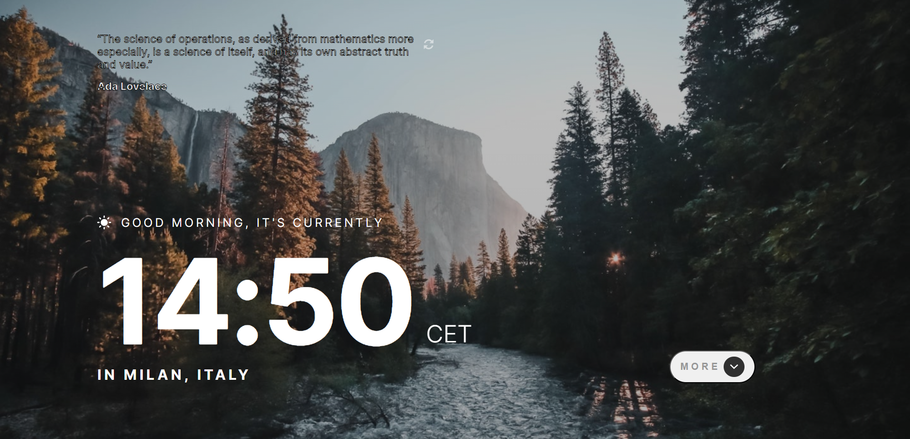

# Clock app

## Table of contents

- [Overview](#overview)
  - [Screenshot](#screenshot)
  - [Links](#links)
- [My process](#my-process)
  - [Built with](#built-with)
  - [What I learned](#what-i-learned)
  - [Continued development](#continued-development)
- [Author](#author)

## Overview

### Screenshot

### Links

- Live Site URL: [https://giovym.github.io/clock-app/](https://giovym.github.io/clock-app/)

## My process

### Built with

- [React](https://reactjs.org/) - JS library
- JavaScript
- API
- JSX
- CSS modules
- Flexbox
- CSS Grid

### What I learned

This was my second project with React. In this project I have used some APIs with Async/Await and the following React Hooks:

- useContext
- useState
- useEffect

### Continued development

My next steps will be to learn Redux and React Router.

## Author

- Website - [Giovanni Marletta](https://github.com/Giovym)
- Linkedin - [@giovanni-marletta](https://www.linkedin.com/in/giovanni-marletta/)
- Twitter - [@GiovanniMa88](https://www.twitter.com/GiovanniMa88)
